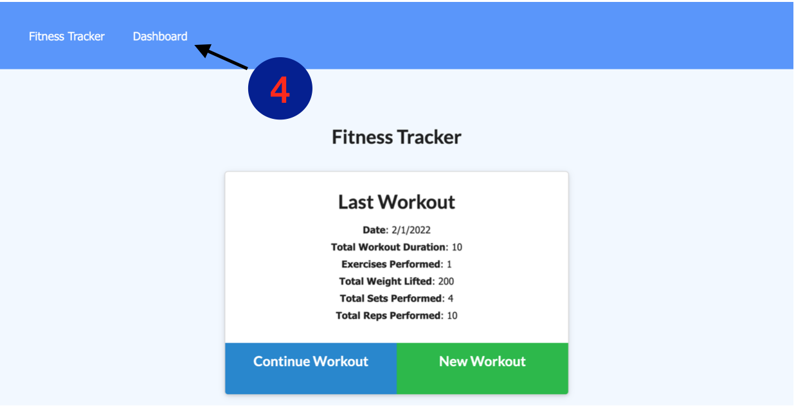
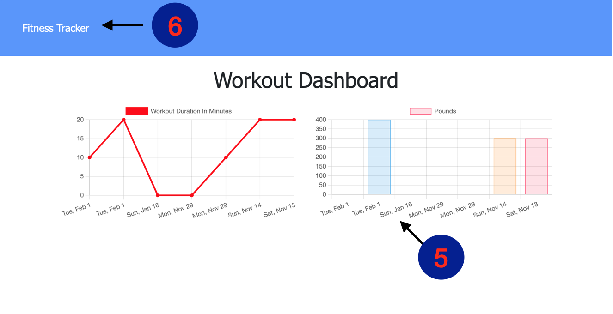

#  GetFit-Workout-Tracker

##  Create and track daily workouts. Log multiple exercises in a workout. Track the name, type, wieght, sets repsm and duration of exercise.
### Table of contents
- [Installation](#installation)
- [Usage](#usage)
- [Contributors](#contributors)
- [License](#license)
### Installation
Install node.js , npm i mongoose, and npm i express
### Usage

When you open this app you can either add a new workout or complete one. 
1. Add a new workout  
2. Or complete a workout

When you begin to add a new workout you will have to fill out all required fields then press the add workout button
3. Add workout button

After filling out your workout you are directed to a logged version of your workout. To view your progress you may click the Dashboard link and will be directed there.
4. Dashboard link

Once you are at the Dashboard you will see your new workout and previous ones on two charts. One for Cardio/ Duration and one for Strength Trainging/ Pounds.  
5.Here you can see your workout being recorded 
6.You can navigate back to the start of the application where you can add or complete a workout by clicking the Fitness Tracker link
## License
This repository is covered by the MIT License    
https://opensource.org/licenses/MIT
#### Contributors
Ethan Cho Damien Luzzo
#### Test Instructions
none
##### Questions
If you have any questions please feel free to contact me through GitHub [CortezStephanie](https://github.com/CortezStephanie)
